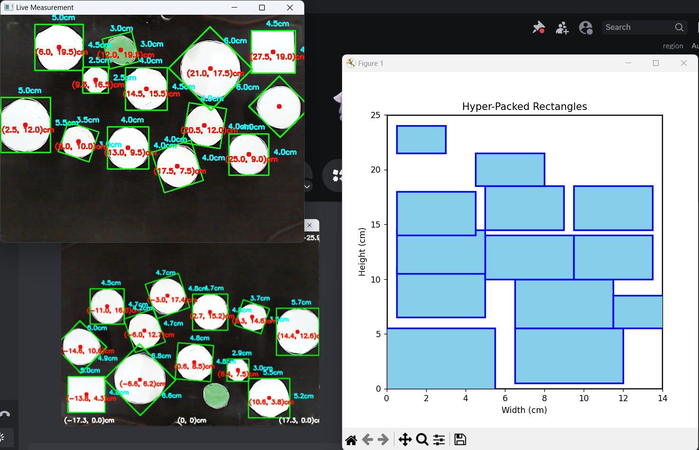
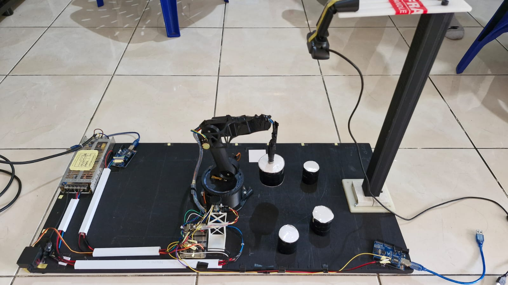

# **3DOF Robotic Arm with HyperPack Optimization & Machine Learning**

## 📌 Project Overview  
This project features a **3DOF robotic arm** that uses a **magnet** to efficiently pick and place items. The system integrates **computer vision and machine learning** to detect objects and their coordinates. It employs **inverse kinematics** for precise movement and utilizes the **HyperPack algorithm** for optimized item arrangement.  

## 🚀 Features  
- 🔧 **3DOF Robotic Arm** (RRR configuration) with servo motors  
- 🧲 **Magnet-based gripping mechanism** for item handling  
- 🤖 **Machine Learning-based Object Detection**  
- 🎯 **Computer Vision** for object tracking and coordinate mapping  
- 🔢 **Inverse Kinematics** for accurate positioning  
- 📦 **HyperPack Algorithm** for optimized item arrangement  
- 🔄 **Arduino Control:**
  - 360° servo with **feedback control**  
  - Two 180° servos with **trajectory planning (linear interpolation)**  

## 🎯 Applications  
- Automated warehouse management  
- Smart sorting and packing systems  
- Robotics and AI research  

## 🔧 Setup Instructions  
1.  🔧 Hardware Requirements  
- 🦾 **3D-Printed Custom Robotic Arm** (3DOF: 360° + 180° + 180° servos)  
- 🧲 **Electromagnet** as the end effector  
- 🎮 **Two Arduino Boards** (one for 360° servo, one for 180° servos)  
- ⚡ **Power Supply:** 5V 40A  
- 📷 **Camera positioned 50cm above the items, looking downward**
- 
2. **Software Requirements**  
   - Arduino IDE for servo control  
   - Python with OpenCV & TensorFlow for object detection  
   - Machine learning model for classification  
   - HyperPack algorithm for efficient item arrangement  

3. **Installation**  
   - Clone this repository:  
     ```bash
     git clone https://github.com/your-repo-name.git
     cd your-repo-name
     ```
   - Install required Python libraries:  
     ```bash
     pip install opencv-python tensorflow numpy
     ```
   - Upload Arduino code to the board using Arduino IDE.  
  
## 🔜 Future Improvements  
- Enhancing machine learning accuracy  
- Adding **Bluetooth connectivity** for mobile control  
- Refining **real-time trajectory planning**  
- Improving **feedback-based servo control**  

---

💡 **Contributions are welcome!** Feel free to fork this repository and submit pull requests.  

📩 **Contact:** For inquiries or collaborations, reach out via GitHub Issues.  





