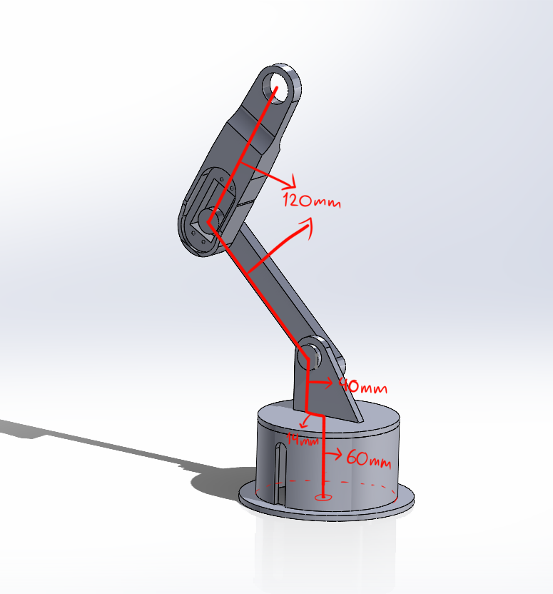

# **3DOF Robotic Arm with HyperPack Optimization & Machine Learning**

## 📌 Project Overview  
This project features a **3DOF robotic arm** that uses a **magnet** to efficiently pick and place items. The system integrates **computer vision and machine learning** to detect objects and their coordinates. It employs **inverse kinematics** for precise movement and utilizes the **HyperPack algorithm** for optimized item arrangement.  

### 🔍 Top-View Machine Learning  
This image shows the **top-down camera perspective** used in the project. It highlights how the system detects objects and determines their coordinates for the robotic arm to pick them up.  
  

---

## 🚀 Features  
- 🔧 **3DOF Robotic Arm** (RRR configuration) with servo motors  
- 🧲 **Magnet-based gripping mechanism** for item handling  
- 🤖 **Machine Learning-based Object Detection**  
- 🎯 **Computer Vision** for object tracking and coordinate mapping  
- 🔢 **Inverse Kinematics** for accurate positioning  
- 📦 **HyperPack Algorithm** for optimized item arrangement  
- 🔄 **Arduino Control:**
  - 360° servo with **feedback control**  
  - Two 180° servos with **trajectory planning (linear interpolation)**  

---

## 🎯 Applications  
- Automated warehouse management  
- Smart sorting and packing systems  
- Robotics and AI research  

---

## 🔧 Setup Instructions  

### 1️⃣ **Hardware Requirements**  
- 🦾 **3D-Printed Custom Robotic Arm** (3DOF: 360° + 180° + 180° servos)  
- 🧲 **Electromagnet** as the end effector  
- 🎮 **Two Arduino Boards** (one for 360° servo, one for 180° servos)  
- ⚡ **Power Supply:** 5V 40A  
- 📷 **Camera positioned 50cm above the items, looking downward**  

📌 **The Whole Project View**  
Below is an image showing the **entire setup**, including the robotic arm, camera, and workspace.  
  

📌 **Project Poster**  
This poster illustrates **how the robot works**, providing an overview of the system’s operation and design.  
  

📌 **Blueprint: Robot’s Length**  
If you want to **replicate this robotic arm**, make sure the dimensions match **exactly** as shown below.  
  

---

### 2️⃣ **Software Requirements**  
- **Arduino IDE** for servo control  
- **Python** with OpenCV & TensorFlow for object detection  
- **Machine Learning Model** for classification  
- **HyperPack Algorithm** for efficient item arrangement  

### 3️⃣ **Installation**  
Clone this repository:  
```bash
git clone https://github.com/RaphaelNazareth/Robotic-Arm-3DOF.git
cd Robotic-Arm-3DOF

